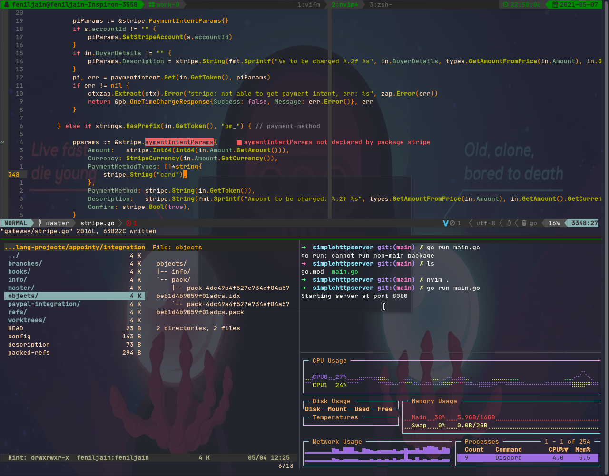

# dotfiles

- A collection of all my config dotfiles
- Neovim config in `nvim/` will only work for nvim 0.7+
- Neovim config in `nvim-coc/` will only work for nvim 0.5+
- This config is made for usage with stow

